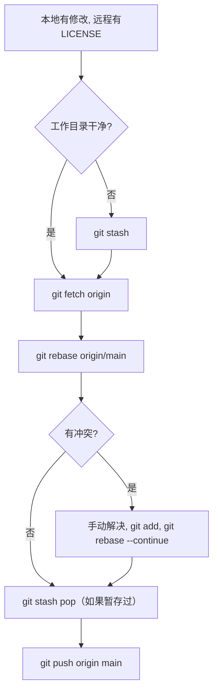

### **使用场景描述**  

**问题背景**：  

1. **远程仓库（Github）**：直接在Github网页上添加了 一些文件，这里以`LICENSE` 文件为例，但本地仓库没有同步这个更改。  
2. **本地仓库**：在本地做了一些代码修改，并尝试提交（`git commit`）或推送（`git push`）时，Git 提示分支分叉（divergent branches），无法直接推送。  

**目标**：  

- 保留远程的 `LICENSE` 文件  
- 顺利提交本地的代码修改  
- 保持提交历史的整洁（避免不必要的合并提交）  

---

### **解决方案：使用 `git rebase` 优雅整合更改**  

#### **适用条件**  

✅ 你的本地分支是**个人开发分支**（尚未推送或只有你自己使用）  
✅ 你希望保持**线性提交历史**，避免多余的 `Merge commit`  

#### **操作步骤**  

##### **1. 确保本地工作目录干净**  

- 如果有未提交的修改，先暂存（避免 rebase 冲突）：  

  ```bash
  git stash
  ```

##### **2. 获取远程最新更改（但不自动合并）**  

```bash
git fetch origin
```

##### **3. 使用 `rebase` 将本地提交“移植”到远程更新之后**  

```bash
git rebase origin/main  # 或你的目标分支（如 main/master）
```

- **执行逻辑**：  
  - Git 会先“撤销”你的本地提交  
  - 然后应用远程的 `LICENSE` 文件更改  
  - 最后重新应用你的本地提交  

##### **4. 处理可能的冲突**  

- 如果 `LICENSE` 文件与你的本地修改冲突（极少数情况），Git 会提示冲突：  

  - 手动解决冲突后，标记文件为已解决：  

    ```bash
    git add <冲突文件>
    ```

  - 继续变基：  

    ```bash
    git rebase --continue
    ```

- 如果想放弃变基（回到原始状态）：  

  ```bash
  git rebase --abort
  ```

##### **5. 恢复暂存的本地修改（如果之前 stash 了）**  

```bash
git stash pop
```

##### **6. 推送更新到远程仓库**  

```bash
git push origin main
```

- 如果之前已经推送过本地分支，需强制推送（谨慎操作，确保只有你自己在用这个分支！）：  

  ```bash
  git push --force-with-lease
  ```

---

### **关键注意事项**  

1. **不要对公共分支强制推送**：  
   - 如果其他人基于这个分支开发，`git push --force` 会破坏他们的提交历史。  
2. **冲突概率低**：  
   - 此场景中，远程只是新增了 `LICENSE` 文件，通常不会与本地代码冲突。  
3. **替代方案**：  
   - 如果不想用 `rebase`，也可以用 `git pull`（默认合并），但会生成一个合并提交。  

---

### **执行流程图**  



### **最终效果**  

- 远程的 `LICENSE` 文件保留  
- 本地修改成功提交  
- 提交历史保持线性，无冗余合并记录  

这种方法既安全又整洁，适合个人分支的同步场景！